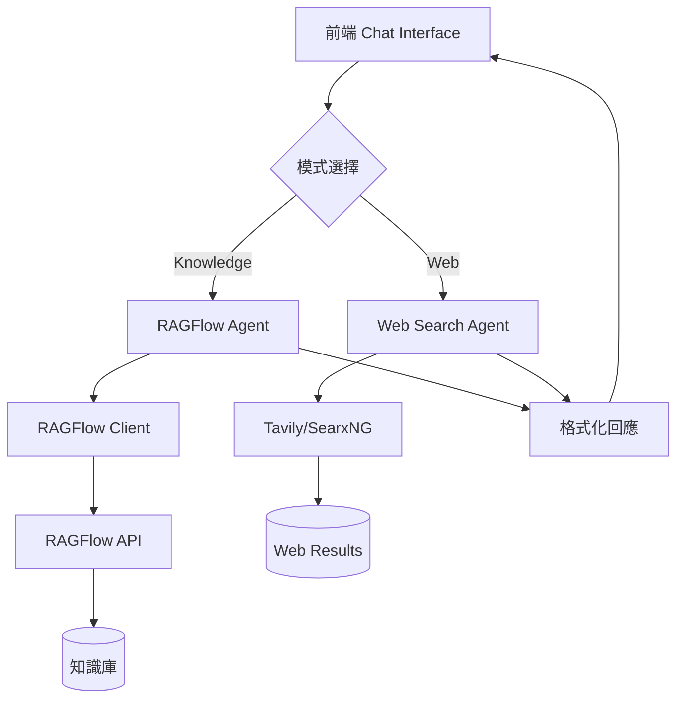

# CLAUDE.md

This file provides guidance to Claude Code (claude.ai/code) when working with code in this repository.

## Key Commands

### Development

- `bun dev` - Start development server with Next.js Turbo mode (http://localhost:3000)
- `bun run build` - Create production build
- `bun start` - Start production server
- `bun lint` - Run ESLint for code quality checks and import sorting
- `bun typecheck` - Run TypeScript type checking
- `bun format` - Format code with Prettier
- `bun format:check` - Check code formatting without modifying files

### Docker

- `docker compose up -d` - Run the application with Docker
- `docker pull ghcr.io/your-username/legalmentor:latest` - Pull prebuilt Docker image

## Architecture Overview

### Tech Stack

- **Next.js 15.2.3** with App Router and React Server Components
- **React 19.0.0** with TypeScript for type safety
- **Vercel AI SDK 4.3.6** for AI streaming and GenerativeUI
- **Supabase** for authentication and backend services
- **Redis** (Upstash or local) for chat history storage
- **Tailwind CSS** with shadcn/ui components

### Core Architecture

1. **App Router Structure** (`/app`)
   - `/api/` - Backend API routes for chat, search, and auth endpoints
   - `/auth/` - Authentication pages (login, signup, password reset)
   - `/search/` - Search functionality and results display
   - `/share/` - Sharing functionality for search results

2. **AI Integration** (`/lib`)
   - `/lib/agents/` - AI agents for research and question generation
   - `/lib/config/` - Model configuration management
   - `/lib/streaming/` - Stream handling for AI responses
   - `/lib/tools/` - Search and retrieval tool implementations
   - Models configured in `public/config/models.json`

3. **Search System**
   - Multiple providers: Tavily (default), SearXNG (self-hosted), Exa (neural)
   - Video search support via Serper API
   - URL-specific search capabilities
   - Configurable search depth and result limits

4. **Component Organization** (`/components`)
   - `/artifact/` - Search result and AI response display components
   - `/sidebar/` - Chat history and navigation
   - `/ui/` - Reusable UI components from shadcn/ui
   - Feature-specific components (auth forms, chat interfaces)

5. **State Management**
   - Server-side state via React Server Components
   - Client-side hooks in `/hooks/`
   - Redis for persistent chat history
   - Supabase for user data

## Environment Configuration

### Required Variables

```bash
OPENAI_API_KEY=      # Default AI provider
TAVILY_API_KEY=      # Default search provider
```

### Optional Features

- Chat history: Set `NEXT_PUBLIC_ENABLE_SAVE_CHAT_HISTORY=true` and configure Redis
- Alternative AI providers: Add corresponding API keys (ANTHROPIC_API_KEY, GOOGLE_GENERATIVE_AI_API_KEY, etc.)
- Alternative search: Configure SEARCH_API and provider-specific settings
- Sharing: Set `NEXT_PUBLIC_ENABLE_SHARE=true`

## Key Development Patterns

1. **AI Streaming**: Uses Vercel AI SDK's streaming capabilities for real-time responses
2. **GenerativeUI**: Dynamic UI components generated based on AI responses
3. **Type Safety**: Strict TypeScript configuration with comprehensive type definitions in `/lib/types/`
4. **Schema Validation**: Zod schemas in `/lib/schema/` for data validation
5. **Error Handling**: Comprehensive error boundaries and fallback UI components

## Testing Approach

Currently no dedicated test framework. Verify changes by:

1. Running `bun lint` to check code quality
2. Building with `bun run build` to catch TypeScript errors
3. Manual testing in development mode

## Pre-PR Requirements

Before creating a pull request, you MUST ensure all of the following checks pass:

1. **Linting**: Run `bun lint` and fix all ESLint errors and warnings (includes import sorting)
2. **Type checking**: Run `bun typecheck` to ensure no TypeScript errors
3. **Formatting**: Run `bun format:check` to verify code formatting (or `bun format` to auto-fix)
4. **Build**: Run `bun run build` to ensure the application builds successfully

These checks are enforced in CI/CD and PRs will fail if any of these steps don't pass.

Note: Import sorting is handled by ESLint using `eslint-plugin-simple-import-sort`. Run `bun lint --fix` to automatically sort imports according to the configured order.

## Model Configuration

Models are defined in `public/config/models.json` with:

- `id`: Model identifier
- `provider`: Display name
- `providerId`: Provider key for API routing
- `enabled`: Toggle availability
- `toolCallType`: "native" or "manual" for function calling
- `toolCallModel`: Optional override for tool calls

## Database Policies

When working with Supabase, follow the cursor rules in `.cursor/rules/` for:

- Creating migrations
- Setting up RLS policies
- Writing edge functions
- SQL style guide

---

## RAGFlow 知識庫整合開發計劃

### 階段 1: 最小可行產品 (MVP) - 1-2 週

#### 目標
將 RAGFlow 知識庫功能整合到現有 Morphic 專案中，實現基本的知識庫問答功能。

#### 開發步驟

##### 1. 環境配置 (Day 1)
- [ ] 添加 RAGFlow 相關環境變數到 `.env.local`
  ```bash
  RAGFLOW_API_URL=http://localhost:9380
  RAGFLOW_API_KEY=your-api-key-here
  RAGFLOW_PROXY_URL=http://localhost:8000  # 可選，如使用代理服務
  ```
- [ ] 更新 `next.config.mjs` 支持 RAGFlow API 調用
- [ ] 安裝必要的依賴包

##### 2. RAGFlow 客戶端整合 (Day 2-3)
- [ ] 創建 `lib/clients/ragflow-client.ts`
  ```typescript
  export class RAGFlowClient {
    private apiUrl: string
    private apiKey: string
    
    async getDatasets(): Promise<Dataset[]>
    async createSession(datasetId: string): Promise<string>
    async chat(sessionId: string, question: string): Promise<ChatResponse>
  }
  ```
- [ ] 實現錯誤處理和重試機制
- [ ] 添加 TypeScript 類型定義 `lib/types/ragflow.ts`

##### 3. API 路由擴展 (Day 4-5)
- [ ] 修改 `app/api/chat/route.ts` 支持模式選擇
  ```typescript
  export async function POST(request: Request) {
    const { messages, mode, datasetId } = await request.json()
    
    if (mode === 'knowledge') {
      return await handleKnowledgeChat(messages, datasetId)
    }
    
    // 現有的 web search 邏輯
    return await handleWebSearch(messages)
  }
  ```
- [ ] 新增 `app/api/datasets/route.ts` 獲取知識庫列表
- [ ] 新增 `app/api/sessions/route.ts` 管理 RAGFlow 會話

##### 4. 前端 UI 擴展 (Day 6-8)
- [ ] 修改 `components/chat-interface.tsx` 添加模式切換
  ```tsx
  const [chatMode, setChatMode] = useState<'web' | 'knowledge'>('web')
  const [selectedDataset, setSelectedDataset] = useState<Dataset | null>(null)
  ```
- [ ] 創建 `components/mode-selector.tsx` 模式選擇組件
- [ ] 創建 `components/dataset-selector.tsx` 知識庫選擇組件
- [ ] 更新聊天消息顯示，支持知識庫來源引用

##### 5. 狀態管理整合 (Day 9-10)
- [ ] 修改 `hooks/use-chat.ts` 支持知識庫模式
- [ ] 實現會話狀態管理，區分 web 和 knowledge 會話
- [ ] 添加知識庫選擇狀態持久化

##### 6. 測試與優化 (Day 11-14)
- [ ] 單元測試：RAGFlow 客戶端功能
- [ ] 集成測試：端到端聊天流程
- [ ] 性能測試：響應時間和併發處理
- [ ] UI/UX 測試：用戶體驗優化

#### 技術架構



#### 文件結構
```
lib/
├── clients/
│   └── ragflow-client.ts          # RAGFlow API 客戶端
├── agents/
│   └── ragflow-agent.ts           # RAGFlow 代理邏輯
├── types/
│   └── ragflow.ts                 # RAGFlow 類型定義
└── utils/
    └── session-manager.ts         # 會話管理工具

components/
├── mode-selector.tsx              # 模式選擇組件
├── dataset-selector.tsx           # 知識庫選擇組件
└── knowledge-source-display.tsx   # 知識來源顯示組件

app/api/
├── chat/route.ts                  # 修改支持模式選擇
├── datasets/route.ts              # 知識庫列表 API
└── sessions/route.ts              # 會話管理 API
```

#### 成功指標
- [ ] 用戶可以在 Web 搜索和知識庫模式間切換
- [ ] 知識庫模式能正確返回相關答案和來源
- [ ] 會話狀態正確管理，支持多輪對話
- [ ] 響應時間 < 3 秒
- [ ] 錯誤處理完善，用戶體驗流暢

#### 風險與緩解
- **RAGFlow 服務不穩定**: 實現重試機制和降級策略
- **API 響應慢**: 添加加載狀態和超時處理
- **知識庫內容不足**: 提供 Web 搜索作為備選方案
- **會話管理複雜**: 簡化初版實現，後續迭代優化

#### 後續階段預覽
- **階段 2**: 混合搜索模式 (Web + Knowledge)
- **階段 3**: 智能路由和意圖識別
- **階段 4**: 高級功能 (多知識庫、個性化等)

---
