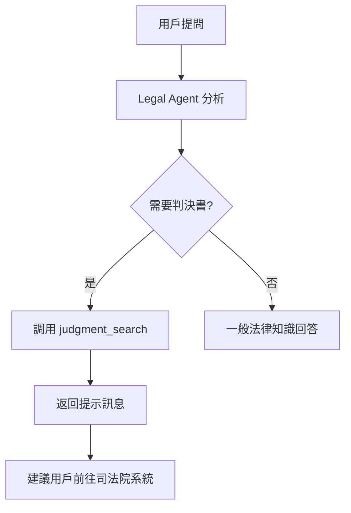

# LegalMentor - 法律專業 AI 助理

## 📋 專案概述

LegalMentor 是一個專為台灣民眾打造的法律 AI 助理，以**司法院判決書系統**為核心數據來源，提供智能法律諮詢服務。

### 核心特色

- 🎯 **B2C 定位**：專為一般民眾設計，使用淺顯易懂的語言
- ⚖️ **判決書搜尋**：整合司法院判決書開放資料 API
- 💬 **智能對話**：民眾友善的 AI 對話體驗
- 📚 **案例分析**：用真實判決案例幫助理解法律

## 🚀 快速開始

### 啟動開發環境

```bash
# 安裝依賴
bun install

# 啟動開發伺服器
bun dev

# 訪問 http://localhost:3000
```

### 環境變數設定

必需的環境變數：
```bash
OPENAI_API_KEY=your_openai_key        # 或其他 AI 提供商
TAVILY_API_KEY=your_tavily_key        # 用於一般搜尋
```

## 🏗️ 架構說明

### 核心組件

#### 1. AI Agents（法律專用）

**`lib/agents/legal-agent.ts`**
- 法律專用 AI Agent，支援原生工具調用
- 整合判決書搜尋、一般搜尋、問題澄清等工具
- 使用民眾友善的系統提示詞

**`lib/agents/manual-legal-agent.ts`**
- 簡化版法律 Agent，用於不支援原生工具調用的模型
- 相同的民眾友善語言風格

#### 2. 判決書搜尋工具

**`lib/tools/judgment-search.ts`**
- 整合司法院開放資料 API
- 提供判決書搜尋和內容檢索功能
- API 端點：
  - 裁判書清單：`http://data.judicial.gov.tw/jdg/api/JList`
  - 裁判書內容：`http://data.judicial.gov.tw/jdg/api/JDoc/{jid}`

主要函數：
```typescript
// 搜尋判決書
createJudgmentSearchTool(model: string)

// 取得單一判決書內容
createGetJudgmentTool(model: string)
```

#### 3. UI 組件

**`components/judgment-card.tsx`**
- `JudgmentCard`：單一判決書卡片展示
- `JudgmentList`：判決書列表
- `JudgmentDetail`：判決書詳細內容

**`components/legal-mentor-empty-screen.tsx`**
- 首頁空狀態，展示常見法律問題範例
- 包含 6 個台灣民眾常見法律問題

**`components/legal-mentor-chat-panel.tsx`**
- 法律風格的聊天介面
- 中文化的歡迎訊息和提示

### 系統提示詞設計

法律 AI 助理遵循以下原則：

1. **民眾友善**
   - 使用白話文，避免艱澀法律術語
   - 必要術語立即括號說明
   - 用生活化例子幫助理解

2. **以判決書為核心**
   - 優先使用 `judgment_search` 工具
   - 引用真實判決案例
   - 說明法院實際判決情況

3. **結構化回答**
   ```
   📋 問題理解
   ⚖️ 法律說明
   💡 實務建議
   ⚠️ 重要提醒
   ```

4. **安全界線**
   - 提供法律資訊參考，非正式法律建議
   - 每次回答結尾都包含免責聲明
   - 複雜案件建議諮詢執業律師

## 📝 常見法律問題範例

系統預設提供以下問題範例：

1. 車禍受傷可以請求什麼賠償？
2. 租屋糾紛怎麼處理？
3. 勞資糾紛如何維權？
4. 消費糾紛退款問題
5. 遺產繼承順序與比例
6. 查詢相關判決案例

## 🔄 判決書搜尋流程

### 當前實作（基礎版）



### 建議升級方案

由於司法院 API 限制（僅提供 7 日前資料，無全文搜尋），建議：

1. **建立本地判決書資料庫**
   ```bash
   # 定期同步司法院資料
   - 使用 JList API 取得新增判決書清單
   - 使用 JDoc API 下載判決書內容
   - 儲存至資料庫（PostgreSQL + 全文搜尋）
   ```

2. **整合搜尋引擎**
   ```bash
   # 使用 Elasticsearch 或類似工具
   - 建立判決書全文索引
   - 支援複雜查詢條件
   - 提供相關性排序
   ```

3. **AI 增強**
   ```bash
   # 使用 Embedding 技術
   - 將判決書向量化
   - 語義搜尋相關判決
   - 提供更精準的案例比對
   ```

## 🎨 品牌與視覺設計

### 配色方案
- 主色調：藍色系（專業、信賴）
- 輔助色：琥珀色（法律象徵）
- 深色模式：完整支援

### 圖標使用
- `Scale`（天平）：法律象徵
- `Gavel`（法槌）：判決象徵
- `Shield`（盾牌）：隱私保護

## ⚠️ 重要注意事項

### 法律合規

1. **免責聲明**
   - 所有回答都必須包含免責聲明
   - 明確說明這是資訊參考，非正式法律建議
   - 建議用戶諮詢執業律師

2. **隱私保護**
   - 不記錄敏感個案細節
   - 符合個資法要求
   - 提供數據刪除功能

3. **避免執業風險**
   - 不提供具體個案法律建議
   - 不保證或預測案件結果
   - 複雜案件建議尋求專業協助

### 技術限制

1. **判決書 API 限制**
   - 僅提供 7 日前的判決書清單
   - 無法直接全文搜尋
   - 建議建立本地資料庫解決

2. **AI 模型限制**
   - 可能產生幻覺（不存在的判決）
   - 需要引用來源驗證
   - 定期更新法律知識

## 📚 開發指南

### 新增法律問題範例

編輯 `components/legal-mentor-empty-screen.tsx`：

```typescript
const legalExampleMessages = [
  {
    heading: '問題標題',
    message: '完整問題描述',
    icon: IconComponent,
    category: '法律類別',
    color: 'text-blue-600 dark:text-blue-400'
  },
  // ... 更多範例
]
```

### 修改系統提示詞

編輯 `lib/agents/legal-agent.ts` 中的 `LEGAL_SYSTEM_PROMPT`

### 自訂判決書展示

使用 `components/judgment-card.tsx` 中的組件：

```tsx
import { JudgmentCard, JudgmentList } from '@/components/judgment-card'

// 單一判決書
<JudgmentCard
  jid="JUDGMENT_ID"
  title="判決書標題"
  court="台北地方法院"
  judgeDate="2024-01-01"
  caseType="民事"
  caseNumber="110年度訴字第1234號"
  url="https://..."
/>

// 判決書列表
<JudgmentList
  judgments={judgmentArray}
  query="搜尋關鍵字"
/>
```

## 🔮 未來規劃

### Phase 1 - 資料庫建設
- [ ] 建立本地判決書資料庫
- [ ] 定期同步司法院資料
- [ ] 實作全文搜尋

### Phase 2 - 功能增強
- [ ] AI 判決書摘要
- [ ] 相似案例推薦
- [ ] 法律文書範本

### Phase 3 - 進階功能
- [ ] 法律知識圖譜
- [ ] 多輪對話優化
- [ ] 個人化法律助理

## 📞 技術支援

如有問題或建議，請聯繫開發團隊。

---

**免責聲明**：LegalMentor 提供的資訊僅供參考，不構成正式法律建議。具體個案請諮詢執業律師。
